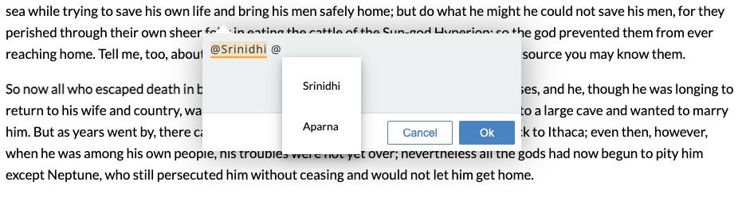

# Recogito Comments-Mention Widget

A Recogito comment thread widget that lets you @-mention users like on Facebook or Twitter.  

<br/>



<br/>


## Run in Development Mode

```sh
$ npm start
```

## Build Widget Distribution

```sh
$ npm run build
```

## Using the plugin

```html
<html>
  <head>
    <script src="recogito.min.js"></script>
    <script src="recogito-comments-mention.min.js"></script>
  </head>
  <body>
    <script type="text/javascript">
      (function() {

        let users = [
          {
            id: 'johndoe@apple.com',
            name: 'John'
          },
          {
            id: '1',
            name: 'Johnny'
          }
        ]

        var r = Recogito.init({
          content: 'content', 
      	  widgets: [
            { widget: recogito.CommentsMention, userSuggestions: users }
          ]
        });
      })();
    </script>
  </body>
</html>
```